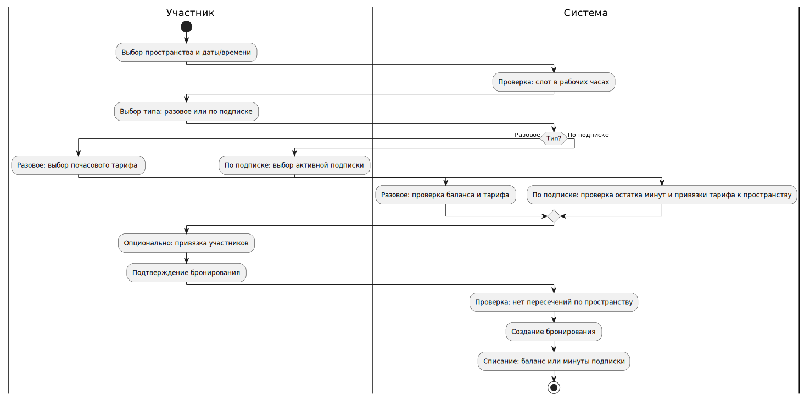
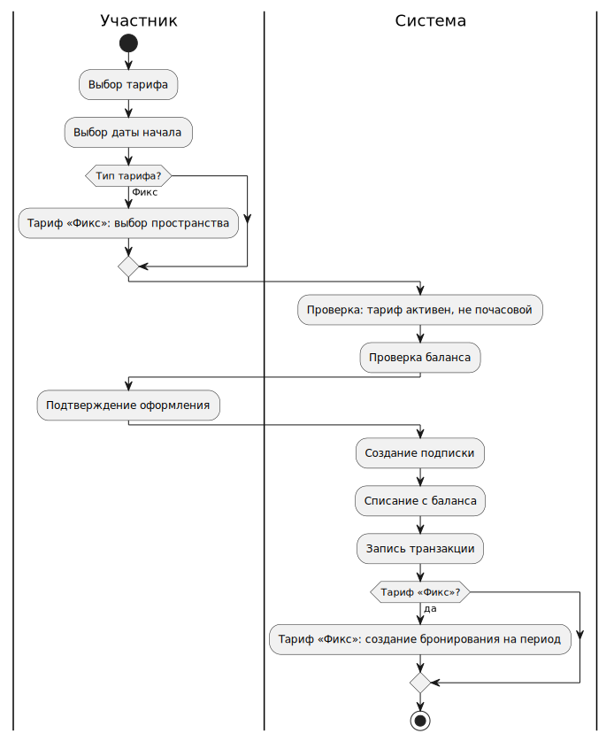
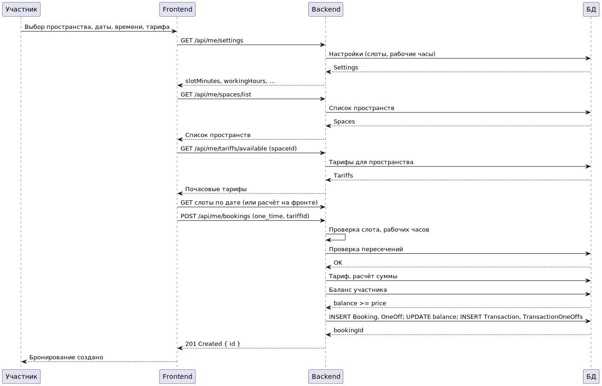
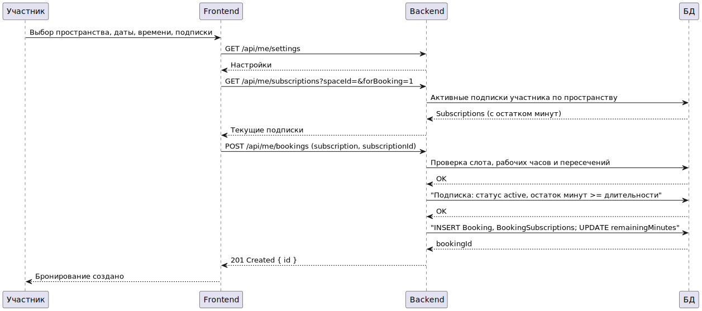
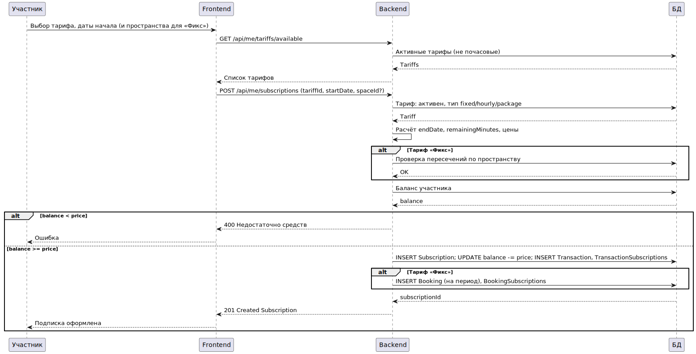

# Лабораторная 4: BPMN и Sequence-диаграммы (UML)

## 1. UML Activity: Оформление бронирования участником

## 2. UML Activity: Оформление подписки участником

## 3. UML Sequence: Создание разового бронирования

## 4. UML Sequence: Бронирование по подписке

## 5. UML Sequence: Покупка подписки

